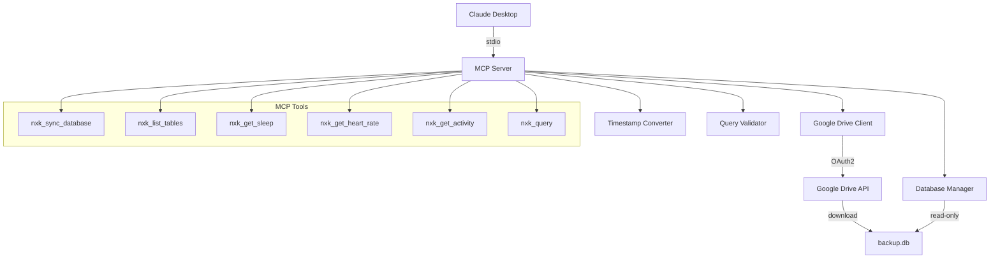

# Design Document: Notify Xiaomi MCP Server

## Overview

The Notify Xiaomi MCP Server is a Python-based Model Context Protocol server that provides programmatic access to health data from the Notify for Xiaomi app. The server downloads a SQLite backup database from Google Drive and exposes health metrics through six MCP tools accessible in Claude Desktop on Windows.

### Key Design Goals

1. **Read-Only Access**: Ensure the backup database remains unmodified through read-only connections and query validation
2. **User-Friendly Timestamps**: Convert Unix timestamps to human-readable YYYY-MM-DD HH:MM format
3. **Secure Authentication**: Use OAuth2 for Google Drive access with token persistence
4. **Norwegian Error Messages**: Provide clear, actionable error messages in Norwegian
5. **Input Validation**: Validate all inputs using Pydantic v2 to prevent invalid operations
6. **Stdio Transport**: Integrate seamlessly with Claude Desktop via stdio communication

### Technology Stack

- **FastMCP**: Framework for building MCP servers with minimal boilerplate
- **Google Drive API v3**: For OAuth2 authentication and file downloads
- **SQLite3**: For read-only database access
- **Pydantic v2**: For input validation and data modeling
- **Python 3.10+**: Runtime environment

## Architecture

### System Components



### Component Responsibilities

#### MCP Server (FastMCP)
- Initialize stdio transport for Claude Desktop communication
- Register and expose six MCP tools
- Coordinate between Google Drive Client, Database Manager, and utility components
- Handle errors and format responses in Norwegian

#### Google Drive Client
- Manage OAuth2 authentication flow using credentials.json
- Store and refresh OAuth2 tokens in token.pickle
- Locate "Notify for xiaomi" folder in Google Drive
- Download backup.db file to local temporary directory

#### Database Manager
- Open SQLite connections in read-only mode (URI with `?mode=ro`)
- Execute SELECT queries and return results
- Provide schema inspection capabilities
- Ensure database file exists before operations

#### Timestamp Converter
- Detect timestamp format (milliseconds vs seconds)
- Convert Unix timestamps to datetime objects
- Format as YYYY-MM-DD HH:MM in local timezone
- Handle conversion errors gracefully

#### Query Validator
- Parse SQL statements to detect operation type
- Reject non-SELECT statements (INSERT, UPDATE, DELETE, DROP, ALTER, CREATE)
- Return Norwegian error messages for invalid queries

### Data Flow

#### Database Synchronization Flow
1. User invokes `nxk_sync_database` tool
2. Google Drive Client authenticates (or reuses token)
3. Client searches for "Notify for xiaomi" folder
4. Client downloads backup.db to temporary directory
5. Server returns confirmation with file size and timestamp

#### Health Data Query Flow
1. User invokes health data tool (sleep, heart rate, or activity)
2. Input validator checks date format and limit parameters
3. Database Manager executes SELECT query with filters
4. Timestamp Converter processes all timestamp fields
5. Server returns JSON results with readable timestamps

#### Custom Query Flow
1. User invokes `nxk_query` with SQL statement
2. Query Validator checks for non-SELECT operations
3. If valid, Database Manager executes query
4. Server returns raw query results as JSON

## Components and Interfaces

### MCP Tools Interface

All tools follow FastMCP's decorator-based registration pattern:

```python
from fastmcp import FastMCP

mcp = FastMCP("Notify Xiaomi Health Data")

@mcp.tool()
def tool_name(param: Type) -> ReturnType:
    """Tool description"""
    # Implementation
```

#### Tool 1: nxk_sync_database

**Purpose**: Download the latest backup database from Google Drive

**Parameters**: None

**Returns**: 
```python
{
    "success": bool,
    "message": str,  # Norwegian confirmation or error
    "file_size_bytes": int,
    "download_timestamp": str  # YYYY-MM-DD HH:MM
}
```

**Error Cases**:
- OAuth2 authentication failure
- Folder "Notify for xiaomi" not found
- File "backup.db" not found
- Download failure

#### Tool 2: nxk_list_tables

**Purpose**: List all tables with their structure and row counts

**Parameters**: None

**Returns**:
```python
{
    "tables": [
        {
            "name": str,
            "columns": [
                {"name": str, "type": str}
            ],
            "row_count": int
        }
    ]
}
```

**Error Cases**:
- Database file not found (prompt to run nxk_sync_database)
- Database read error

#### Tool 3: nxk_get_sleep

**Purpose**: Retrieve sleep data with readable timestamps

**Parameters**:
```python
class SleepParams(BaseModel):
    start_date: Optional[str] = None  # YYYY-MM-DD
    end_date: Optional[str] = None    # YYYY-MM-DD
    limit: Optional[int] = 100        # Max 1000
```

**Returns**:
```python
{
    "records": [
        {
            "start_time": str,      # YYYY-MM-DD HH:MM
            "end_time": str,        # YYYY-MM-DD HH:MM
            "duration_minutes": int,
            "deep_sleep_minutes": int,
            "light_sleep_minutes": int,
            # Additional fields from database
        }
    ],
    "count": int
}
```

**Error Cases**:
- Invalid date format
- Invalid limit value
- Database not found
- Query execution error

#### Tool 4: nxk_get_heart_rate

**Purpose**: Retrieve heart rate measurements with readable timestamps

**Parameters**:
```python
class HeartRateParams(BaseModel):
    start_date: Optional[str] = None  # YYYY-MM-DD
    end_date: Optional[str] = None    # YYYY-MM-DD
    limit: Optional[int] = 100        # Max 1000
```

**Returns**:
```python
{
    "records": [
        {
            "timestamp": str,  # YYYY-MM-DD HH:MM
            "bpm": int,
            # Additional fields from database
        }
    ],
    "count": int
}
```

**Error Cases**:
- Invalid date format
- Invalid limit value
- Database not found
- Query execution error

#### Tool 5: nxk_get_activity

**Purpose**: Retrieve activity data including steps, calories, and distance

**Parameters**:
```python
class ActivityParams(BaseModel):
    start_date: Optional[str] = None  # YYYY-MM-DD
    end_date: Optional[str] = None    # YYYY-MM-DD
    limit: Optional[int] = 100        # Max 1000
```

**Returns**:
```python
{
    "records": [
        {
            "date": str,           # YYYY-MM-DD HH:MM
            "steps": int,
            "calories": float,
            "distance_meters": float,
            # Additional fields from database
        }
    ],
    "count": int
}
```

**Error Cases**:
- Invalid date format
- Invalid limit value
- Database not found
- Query execution error

#### Tool 6: nxk_query

**Purpose**: Execute custom SELECT queries against the database

**Parameters**:
```python
class QueryParams(BaseModel):
    sql: str  # SQL SELECT statement
```

**Returns**:
```python
{
    "columns": List[str],
    "rows": List[List[Any]],
    "row_count": int
}
```

**Error Cases**:
- Non-SELECT statement detected
- Invalid SQL syntax
- Database not found
- Query execution error

### Google Drive Client Interface

```python
class GoogleDriveClient:
    def __init__(self, credentials_path: str, token_path: str):
        """Initialize with paths to credentials.json and token.pickle"""
        
    def authenticate(self) -> bool:
        """Authenticate or refresh OAuth2 token. Returns success status."""
        
    def find_folder(self, folder_name: str) -> Optional[str]:
        """Find folder by name, return folder ID or None"""
        
    def download_file(self, folder_id: str, filename: str, destination: str) -> bool:
        """Download file from folder to destination path. Returns success status."""
        
    def get_last_error(self) -> str:
        """Return last error message in Norwegian"""
```

### Database Manager Interface

```python
class DatabaseManager:
    def __init__(self, db_path: str):
        """Initialize with path to backup.db"""
        
    def exists(self) -> bool:
        """Check if database file exists"""
        
    def get_tables(self) -> List[Dict[str, Any]]:
        """Return list of tables with columns and row counts"""
        
    def execute_query(self, sql: str, params: Optional[Dict] = None) -> List[Dict[str, Any]]:
        """Execute SELECT query and return results as list of dicts"""
        
    def get_sleep_data(self, start_date: Optional[str], end_date: Optional[str], limit: int) -> List[Dict]:
        """Query sleep data with filters"""
        
    def get_heart_rate_data(self, start_date: Optional[str], end_date: Optional[str], limit: int) -> List[Dict]:
        """Query heart rate data with filters"""
        
    def get_activity_data(self, start_date: Optional[str], end_date: Optional[str], limit: int) -> List[Dict]:
        """Query activity data with filters"""
```

### Utility Interfaces

```python
class TimestampConverter:
    @staticmethod
    def convert(timestamp: Union[int, float]) -> str:
        """Convert Unix timestamp to YYYY-MM-DD HH:MM format"""
        
    @staticmethod
    def is_milliseconds(timestamp: Union[int, float]) -> bool:
        """Detect if timestamp is in milliseconds"""

class QueryValidator:
    @staticmethod
    def is_select_only(sql: str) -> bool:
        """Check if SQL contains only SELECT statement"""
        
    @staticmethod
    def get_error_message() -> str:
        """Return Norwegian error message for invalid query"""
```

## Data Models

### Pydantic Models for Input Validation

```python
from pydantic import BaseModel, Field, field_validator
from typing import Optional
from datetime import datetime

class DateRangeParams(BaseModel):
    """Base model for date range queries"""
    start_date: Optional[str] = Field(None, description="Start date in YYYY-MM-DD format")
    end_date: Optional[str] = Field(None, description="End date in YYYY-MM-DD format")
    limit: Optional[int] = Field(100, ge=1, le=1000, description="Maximum number of records")
    
    @field_validator('start_date', 'end_date')
    @classmethod
    def validate_date_format(cls, v: Optional[str]) -> Optional[str]:
        if v is None:
            return v
        try:
            datetime.strptime(v, '%Y-%m-%d')
            return v
        except ValueError:
            raise ValueError('Dato må være i formatet YYYY-MM-DD')

class SleepParams(DateRangeParams):
    """Parameters for sleep data queries"""
    pass

class HeartRateParams(DateRangeParams):
    """Parameters for heart rate queries"""
    pass

class ActivityParams(DateRangeParams):
    """Parameters for activity queries"""
    pass

class QueryParams(BaseModel):
    """Parameters for custom SQL queries"""
    sql: str = Field(..., min_length=1, description="SQL SELECT statement")
    
    @field_validator('sql')
    @classmethod
    def validate_select_only(cls, v: str) -> str:
        # Remove comments and normalize whitespace
        sql_normalized = ' '.join(v.strip().split()).upper()
        
        # Check for forbidden keywords
        forbidden = ['INSERT', 'UPDATE', 'DELETE', 'DROP', 'ALTER', 'CREATE', 'TRUNCATE', 'REPLACE']
        for keyword in forbidden:
            if keyword in sql_normalized:
                raise ValueError(f'Kun SELECT-spørringer er tillatt. Fant forbudt nøkkelord: {keyword}')
        
        # Ensure it starts with SELECT
        if not sql_normalized.startswith('SELECT'):
            raise ValueError('Spørringen må starte med SELECT')
            
        return v
```

### Database Schema Models

Based on typical Notify for Xiaomi database structure:

```python
# These are not Pydantic models, but documentation of expected database schema

# Sleep table (example structure)
sleep_table = {
    "id": "INTEGER PRIMARY KEY",
    "start": "INTEGER",  # Unix timestamp
    "stop": "INTEGER",   # Unix timestamp
    "deep": "INTEGER",   # Minutes
    "light": "INTEGER",  # Minutes
}

# Heart rate table (example structure)
heart_rate_table = {
    "id": "INTEGER PRIMARY KEY",
    "date": "INTEGER",  # Unix timestamp
    "heart_rate": "INTEGER",  # BPM
}

# Activity table (example structure)
activity_table = {
    "id": "INTEGER PRIMARY KEY",
    "date": "INTEGER",  # Unix timestamp
    "steps": "INTEGER",
    "calories": "REAL",
    "distance": "REAL",  # Meters
}
```

### Response Models

```python
class SyncResponse(BaseModel):
    success: bool
    message: str
    file_size_bytes: Optional[int] = None
    download_timestamp: Optional[str] = None

class TableInfo(BaseModel):
    name: str
    columns: List[Dict[str, str]]
    row_count: int

class TablesResponse(BaseModel):
    tables: List[TableInfo]

class HealthDataResponse(BaseModel):
    records: List[Dict[str, Any]]
    count: int

class QueryResponse(BaseModel):
    columns: List[str]
    rows: List[List[Any]]
    row_count: int
```


## Implementation Details

### FastMCP Server Setup

```python
from fastmcp import FastMCP
import sys

# Initialize FastMCP server
mcp = FastMCP(
    name="Notify Xiaomi Health Data",
    version="1.0.0"
)

# Tool registration happens via decorators
@mcp.tool()
def nxk_sync_database() -> dict:
    """Synkroniser backup-databasen fra Google Drive"""
    # Implementation

# Run server with stdio transport
if __name__ == "__main__":
    mcp.run(transport="stdio")
```

### Google Drive Authentication Flow

The OAuth2 flow follows these steps:

1. **First Run**: 
   - Read `credentials.json` (OAuth2 client credentials from Google Cloud Console)
   - Initiate OAuth2 flow, opening browser for user consent
   - Save access token and refresh token to `token.pickle`

2. **Subsequent Runs**:
   - Load `token.pickle`
   - Check if token is expired
   - If expired, use refresh token to get new access token
   - Update `token.pickle` with new token

3. **Implementation**:
```python
from google.oauth2.credentials import Credentials
from google_auth_oauthlib.flow import InstalledAppFlow
from google.auth.transport.requests import Request
from googleapiclient.discovery import build
import pickle
import os

SCOPES = ['https://www.googleapis.com/auth/drive.readonly']

def authenticate_google_drive(credentials_path: str, token_path: str):
    creds = None
    
    # Load existing token
    if os.path.exists(token_path):
        with open(token_path, 'rb') as token:
            creds = pickle.load(token)
    
    # Refresh or create new token
    if not creds or not creds.valid:
        if creds and creds.expired and creds.refresh_token:
            creds.refresh(Request())
        else:
            flow = InstalledAppFlow.from_client_secrets_file(
                credentials_path, SCOPES)
            creds = flow.run_local_server(port=0)
        
        # Save token
        with open(token_path, 'wb') as token:
            pickle.dump(creds, token)
    
    return build('drive', 'v3', credentials=creds)
```

### Database Connection Pattern

All database operations use read-only connections:

```python
import sqlite3
from typing import List, Dict, Any

def get_readonly_connection(db_path: str) -> sqlite3.Connection:
    """Open database in read-only mode"""
    uri = f"file:{db_path}?mode=ro"
    conn = sqlite3.connect(uri, uri=True)
    conn.row_factory = sqlite3.Row  # Return rows as dicts
    return conn

def execute_query(db_path: str, sql: str, params: Dict = None) -> List[Dict[str, Any]]:
    """Execute SELECT query and return results"""
    conn = get_readonly_connection(db_path)
    try:
        cursor = conn.cursor()
        if params:
            cursor.execute(sql, params)
        else:
            cursor.execute(sql)
        
        # Convert Row objects to dicts
        columns = [desc[0] for desc in cursor.description]
        results = []
        for row in cursor.fetchall():
            results.append(dict(zip(columns, row)))
        
        return results
    finally:
        conn.close()
```

### Timestamp Conversion Implementation

```python
from datetime import datetime
from typing import Union

def convert_timestamp(timestamp: Union[int, float, str]) -> str:
    """
    Convert Unix timestamp to YYYY-MM-DD HH:MM format.
    Handles both seconds and milliseconds.
    """
    try:
        # Handle string input
        if isinstance(timestamp, str):
            timestamp = float(timestamp)
        
        # Detect milliseconds (timestamps after year 2000 in seconds are > 946684800)
        # If timestamp is > 10 billion, it's likely in milliseconds
        if timestamp > 10_000_000_000:
            timestamp = timestamp / 1000
        
        # Convert to datetime
        dt = datetime.fromtimestamp(timestamp)
        
        # Format as YYYY-MM-DD HH:MM
        return dt.strftime('%Y-%m-%d %H:%M')
    
    except (ValueError, OSError, OverflowError):
        # Return original value as string if conversion fails
        return str(timestamp)

def convert_timestamps_in_record(record: Dict[str, Any], timestamp_fields: List[str]) -> Dict[str, Any]:
    """Convert specified timestamp fields in a record"""
    result = record.copy()
    for field in timestamp_fields:
        if field in result and result[field] is not None:
            result[field] = convert_timestamp(result[field])
    return result
```

### Query Validation Implementation

```python
import re
from typing import Tuple

def validate_select_query(sql: str) -> Tuple[bool, str]:
    """
    Validate that SQL query is SELECT-only.
    Returns (is_valid, error_message_norwegian)
    """
    # Normalize: remove comments and extra whitespace
    sql_clean = re.sub(r'--.*$', '', sql, flags=re.MULTILINE)  # Remove -- comments
    sql_clean = re.sub(r'/\*.*?\*/', '', sql_clean, flags=re.DOTALL)  # Remove /* */ comments
    sql_normalized = ' '.join(sql_clean.strip().split()).upper()
    
    # Check for forbidden keywords
    forbidden_keywords = [
        'INSERT', 'UPDATE', 'DELETE', 'DROP', 'ALTER', 
        'CREATE', 'TRUNCATE', 'REPLACE', 'PRAGMA'
    ]
    
    for keyword in forbidden_keywords:
        if re.search(rf'\b{keyword}\b', sql_normalized):
            return False, f"Kun SELECT-spørringer er tillatt. Fant forbudt nøkkelord: {keyword}"
    
    # Ensure it starts with SELECT
    if not sql_normalized.startswith('SELECT'):
        return False, "Spørringen må starte med SELECT"
    
    return True, ""
```

### Error Message Patterns (Norwegian)

```python
ERROR_MESSAGES = {
    "db_not_found": "Databasen ble ikke funnet. Kjør nxk_sync_database først for å laste ned databasen.",
    "auth_failed": "Google Drive-autentisering feilet. Sjekk at credentials.json er riktig konfigurert.",
    "folder_not_found": "Fant ikke mappen 'Notify for xiaomi' i Google Drive.",
    "file_not_found": "Fant ikke filen 'backup.db' i mappen.",
    "download_failed": "Nedlasting av backup.db feilet: {error}",
    "invalid_date": "Ugyldig datoformat. Bruk YYYY-MM-DD.",
    "invalid_limit": "Grenseverdien må være mellom 1 og 1000.",
    "query_not_select": "Kun SELECT-spørringer er tillatt.",
    "query_failed": "SQL-spørring feilet: {error}",
    "db_read_error": "Kunne ikke lese fra databasen: {error}",
}

def get_error_message(key: str, **kwargs) -> str:
    """Get Norwegian error message with optional formatting"""
    return ERROR_MESSAGES[key].format(**kwargs)
```

### File Paths and Configuration

```python
import os
from pathlib import Path
import tempfile

# Configuration paths
CONFIG_DIR = Path.home() / ".notify-xiaomi-mcp"
CONFIG_DIR.mkdir(exist_ok=True)

CREDENTIALS_PATH = CONFIG_DIR / "credentials.json"
TOKEN_PATH = CONFIG_DIR / "token.pickle"
DATABASE_PATH = CONFIG_DIR / "backup.db"

# Google Drive configuration
DRIVE_FOLDER_NAME = "Notify for xiaomi"
DRIVE_FILE_NAME = "backup.db"

# Query limits
DEFAULT_LIMIT = 100
MAX_LIMIT = 1000
```


## Correctness Properties

*A property is a characteristic or behavior that should hold true across all valid executions of a system—essentially, a formal statement about what the system should do. Properties serve as the bridge between human-readable specifications and machine-verifiable correctness guarantees.*

### Property 1: OAuth2 Token Persistence

*For any* successful OAuth2 authentication, the system SHALL store a valid token in token.pickle that can be loaded and reused in subsequent sessions.

**Validates: Requirements 1.2, 1.3**

### Property 2: OAuth2 Token Refresh

*For any* expired OAuth2 token with a valid refresh token, the system SHALL automatically refresh the token without requiring user interaction.

**Validates: Requirements 1.4**

### Property 3: Google Drive Folder Location

*For any* invocation of nxk_sync_database, the system SHALL search for a folder named "Notify for xiaomi" in Google Drive.

**Validates: Requirements 2.1**

### Property 4: Database File Download

*For any* successful folder location, the system SHALL download the file named "backup.db" to the local directory.

**Validates: Requirements 2.2**

### Property 5: Database File Overwrite

*For any* existing local backup.db file, syncing SHALL overwrite it with the newly downloaded version.

**Validates: Requirements 2.3**

### Property 6: Sync Success Response Completeness

*For any* successful database download, the response SHALL include file_size_bytes and download_timestamp fields.

**Validates: Requirements 2.5**

### Property 7: Table Schema Completeness

*For any* table in the database, the nxk_list_tables response SHALL include the table name, all column names with their data types, and the total row count.

**Validates: Requirements 3.1, 3.2, 3.3, 3.4**

### Property 8: Health Data Date Filtering (Start Date)

*For any* health data query (sleep, heart rate, or activity) with a start_date parameter, all returned records SHALL have timestamps on or after the specified start_date.

**Validates: Requirements 4.3, 5.3, 6.4**

### Property 9: Health Data Date Filtering (End Date)

*For any* health data query (sleep, heart rate, or activity) with an end_date parameter, all returned records SHALL have timestamps on or before the specified end_date.

**Validates: Requirements 4.4, 5.4, 6.5**

### Property 10: Health Data Limit Enforcement

*For any* health data query with a limit parameter, the number of returned records SHALL be less than or equal to the specified limit (capped at 1000).

**Validates: Requirements 4.5, 4.7, 5.5, 5.7, 6.6, 6.8**

### Property 11: Timestamp Format Conversion

*For any* valid Unix timestamp (in seconds or milliseconds), the Timestamp_Converter SHALL produce a string in YYYY-MM-DD HH:MM format.

**Validates: Requirements 4.2, 5.2, 6.2, 8.4**

### Property 12: Timestamp Format Detection

*For any* timestamp value greater than 10,000,000,000, the Timestamp_Converter SHALL treat it as milliseconds and divide by 1000 before conversion.

**Validates: Requirements 8.1, 8.2**

### Property 13: Activity Data Field Completeness

*For any* activity data query, each returned record SHALL include steps, calories, and distance fields.

**Validates: Requirements 6.3**

### Property 14: Query Validation (SELECT-Only)

*For any* SQL query containing keywords INSERT, UPDATE, DELETE, DROP, ALTER, CREATE, TRUNCATE, REPLACE, or PRAGMA, the Query_Validator SHALL reject the query.

**Validates: Requirements 7.1, 7.2, 9.2**

### Property 15: Valid SELECT Query Execution

*For any* valid SELECT query, the nxk_query tool SHALL execute it against the database and return results as JSON with columns and rows.

**Validates: Requirements 7.3, 7.4**

### Property 16: Read-Only Database Connection

*For any* database operation, the connection SHALL be opened in read-only mode (using URI with ?mode=ro parameter).

**Validates: Requirements 9.1, 9.3**

### Property 17: Date Format Validation

*For any* date parameter that does not match YYYY-MM-DD format, the system SHALL reject the input with a validation error.

**Validates: Requirements 11.1**

### Property 18: Limit Parameter Validation

*For any* limit parameter that is not a positive integer, the system SHALL reject the input with a validation error.

**Validates: Requirements 11.2**

### Property 19: Required Parameter Validation

*For any* tool invocation missing required parameters, the system SHALL reject the request with a validation error.

**Validates: Requirements 11.5**

### Property 20: Norwegian Error Messages

*For any* error condition (authentication failure, missing database, invalid query, validation failure), the system SHALL return an error message in Norwegian.

**Validates: Requirements 1.5, 2.4, 7.5, 9.4, 11.3, 12.1, 12.4, 12.5**

### Property 21: Error Logging to Stderr

*For any* error that occurs during operation, the system SHALL log the error to standard error.

**Validates: Requirements 10.4**


## Error Handling

### Error Categories

The system handles four main categories of errors:

1. **Authentication Errors**: OAuth2 failures, missing credentials, token refresh failures
2. **Resource Errors**: Missing database file, missing Google Drive folder/file
3. **Validation Errors**: Invalid date format, invalid limit, invalid SQL query
4. **Execution Errors**: Database read errors, SQL execution failures, download failures

### Error Response Structure

All errors follow a consistent structure:

```python
{
    "success": False,
    "error": str,  # Norwegian error message
    "error_type": str,  # Category: "auth", "resource", "validation", "execution"
    "details": Optional[str]  # Additional technical details when available
}
```

### Error Handling Patterns

#### Authentication Errors

```python
try:
    service = authenticate_google_drive(CREDENTIALS_PATH, TOKEN_PATH)
except FileNotFoundError:
    return {
        "success": False,
        "error": "Fant ikke credentials.json. Plasser filen i ~/.notify-xiaomi-mcp/",
        "error_type": "auth"
    }
except Exception as e:
    return {
        "success": False,
        "error": f"Google Drive-autentisering feilet: {str(e)}",
        "error_type": "auth",
        "details": str(e)
    }
```

#### Resource Errors

```python
if not DATABASE_PATH.exists():
    return {
        "success": False,
        "error": "Databasen ble ikke funnet. Kjør nxk_sync_database først for å laste ned databasen.",
        "error_type": "resource"
    }
```

#### Validation Errors

Pydantic v2 automatically raises ValidationError for invalid inputs. These are caught and converted to Norwegian messages:

```python
from pydantic import ValidationError

try:
    params = SleepParams(**input_data)
except ValidationError as e:
    # Extract first error message
    error_msg = e.errors()[0]['msg']
    return {
        "success": False,
        "error": error_msg,  # Already in Norwegian from field_validator
        "error_type": "validation"
    }
```

#### Execution Errors

```python
try:
    results = execute_query(DATABASE_PATH, sql)
except sqlite3.Error as e:
    return {
        "success": False,
        "error": f"SQL-spørring feilet: {str(e)}",
        "error_type": "execution",
        "details": str(e)
    }
```

### Error Message Catalog (Norwegian)

```python
NORWEGIAN_ERRORS = {
    # Authentication
    "auth_no_credentials": "Fant ikke credentials.json. Plasser filen i ~/.notify-xiaomi-mcp/",
    "auth_failed": "Google Drive-autentisering feilet. Sjekk at credentials.json er riktig konfigurert.",
    "auth_token_refresh_failed": "Kunne ikke fornye tilgangstokenet. Prøv å slette token.pickle og autentiser på nytt.",
    
    # Resources
    "db_not_found": "Databasen ble ikke funnet. Kjør nxk_sync_database først for å laste ned databasen.",
    "folder_not_found": "Fant ikke mappen 'Notify for xiaomi' i Google Drive.",
    "file_not_found": "Fant ikke filen 'backup.db' i mappen.",
    "download_failed": "Nedlasting av backup.db feilet",
    
    # Validation
    "invalid_date_format": "Ugyldig datoformat. Bruk YYYY-MM-DD (f.eks. 2024-01-15).",
    "invalid_limit": "Grenseverdien må være et positivt heltall mellom 1 og 1000.",
    "missing_required_param": "Mangler påkrevd parameter",
    "query_not_select": "Kun SELECT-spørringer er tillatt. Fant forbudt nøkkelord",
    
    # Execution
    "db_read_error": "Kunne ikke lese fra databasen",
    "query_execution_failed": "SQL-spørring feilet",
    "timestamp_conversion_failed": "Kunne ikke konvertere tidsstempel",
}
```

### Graceful Degradation

When non-critical operations fail, the system continues with degraded functionality:

- **Timestamp Conversion Failure**: Return original value as string instead of failing the entire query
- **Partial Schema Read**: Return available table information even if some tables fail to read
- **Token Refresh Failure**: Prompt for re-authentication instead of crashing

## Testing Strategy

### Dual Testing Approach

The testing strategy employs both unit tests and property-based tests to ensure comprehensive coverage:

- **Unit Tests**: Verify specific examples, edge cases, and integration points
- **Property-Based Tests**: Verify universal properties across randomized inputs

### Property-Based Testing Configuration

**Framework**: `hypothesis` (Python property-based testing library)

**Configuration**:
```python
from hypothesis import given, settings, strategies as st

# Configure for minimum 100 iterations per test
@settings(max_examples=100)
@given(...)
def test_property(...):
    pass
```

**Test Tagging**: Each property test references its design document property:

```python
def test_property_11_timestamp_format_conversion():
    """
    Feature: notify-xiaomi-mcp-server, Property 11: 
    For any valid Unix timestamp (in seconds or milliseconds), 
    the Timestamp_Converter SHALL produce a string in YYYY-MM-DD HH:MM format.
    """
    # Test implementation
```

### Property-Based Test Cases

Each correctness property maps to a property-based test:

#### Property 1: OAuth2 Token Persistence
```python
@given(st.text(min_size=10))  # Mock token data
def test_property_1_token_persistence(token_data):
    """Feature: notify-xiaomi-mcp-server, Property 1"""
    # Save token, reload, verify it matches
```

#### Property 7: Table Schema Completeness
```python
@given(st.lists(st.text(min_size=1), min_size=1))  # Table names
def test_property_7_table_schema_completeness(table_names):
    """Feature: notify-xiaomi-mcp-server, Property 7"""
    # For each table, verify response includes name, columns, types, row count
```

#### Property 8 & 9: Date Filtering
```python
@given(
    st.dates(min_value=date(2020, 1, 1)),  # start_date
    st.dates(min_value=date(2020, 1, 1)),  # end_date
    st.sampled_from(['sleep', 'heart_rate', 'activity'])  # data type
)
def test_property_8_9_date_filtering(start_date, end_date, data_type):
    """Feature: notify-xiaomi-mcp-server, Property 8 & 9"""
    # Query with date range, verify all results fall within range
```

#### Property 10: Limit Enforcement
```python
@given(
    st.integers(min_value=1, max_value=2000),  # limit (including > 1000)
    st.sampled_from(['sleep', 'heart_rate', 'activity'])
)
def test_property_10_limit_enforcement(limit, data_type):
    """Feature: notify-xiaomi-mcp-server, Property 10"""
    # Query with limit, verify results <= min(limit, 1000)
```

#### Property 11 & 12: Timestamp Conversion
```python
@given(
    st.one_of(
        st.integers(min_value=946684800, max_value=2147483647),  # seconds
        st.integers(min_value=946684800000, max_value=2147483647000)  # milliseconds
    )
)
def test_property_11_12_timestamp_conversion(timestamp):
    """Feature: notify-xiaomi-mcp-server, Property 11 & 12"""
    result = convert_timestamp(timestamp)
    # Verify format matches YYYY-MM-DD HH:MM
    assert re.match(r'\d{4}-\d{2}-\d{2} \d{2}:\d{2}', result)
```

#### Property 14: Query Validation
```python
@given(
    st.sampled_from(['INSERT', 'UPDATE', 'DELETE', 'DROP', 'ALTER', 'CREATE']),
    st.text(min_size=1)
)
def test_property_14_query_validation(forbidden_keyword, query_body):
    """Feature: notify-xiaomi-mcp-server, Property 14"""
    sql = f"{forbidden_keyword} {query_body}"
    is_valid, error = validate_select_query(sql)
    assert not is_valid
    assert forbidden_keyword in error
```

#### Property 17: Date Format Validation
```python
@given(st.text().filter(lambda x: not re.match(r'\d{4}-\d{2}-\d{2}', x)))
def test_property_17_date_format_validation(invalid_date):
    """Feature: notify-xiaomi-mcp-server, Property 17"""
    with pytest.raises(ValidationError):
        DateRangeParams(start_date=invalid_date)
```

#### Property 20: Norwegian Error Messages
```python
@given(
    st.sampled_from(['auth', 'resource', 'validation', 'execution']),
    st.text(min_size=1)
)
def test_property_20_norwegian_error_messages(error_type, context):
    """Feature: notify-xiaomi-mcp-server, Property 20"""
    error_msg = generate_error_message(error_type, context)
    # Verify message contains Norwegian words
    norwegian_indicators = ['feilet', 'ikke', 'fant', 'ugyldig', 'må', 'kunne']
    assert any(word in error_msg.lower() for word in norwegian_indicators)
```

### Unit Test Cases

Unit tests focus on specific examples and edge cases:

#### Edge Cases from Requirements

1. **Default Limit (4.6, 5.6, 6.7)**: Test that omitting limit parameter defaults to 100 records
2. **Maximum Limit (4.7, 5.7, 6.8)**: Test that limit > 1000 is capped at 1000
3. **Missing Database (3.5)**: Test that operations fail with appropriate Norwegian error when database doesn't exist
4. **Invalid Timestamp Conversion (8.5)**: Test that unconvertible timestamps return original value as string
5. **Missing Database Error Message (12.3)**: Test that missing database error mentions nxk_sync_database

#### Integration Tests

1. **First-Time Authentication (1.1)**: Test OAuth2 flow when token.pickle doesn't exist
2. **Database Overwrite (2.3)**: Test that sync overwrites existing database file
3. **Stdio Transport (10.1-10.3)**: Test that server communicates via stdin/stdout
4. **End-to-End Tool Execution**: Test each of the six tools with realistic data

#### Example Unit Tests

```python
def test_default_limit_is_100():
    """Test that omitting limit defaults to 100 records"""
    params = SleepParams()
    assert params.limit == 100

def test_limit_capped_at_1000():
    """Test that limit > 1000 is capped"""
    params = SleepParams(limit=5000)
    results = get_sleep_data(params)
    assert len(results) <= 1000

def test_missing_database_error_message():
    """Test that missing database error mentions nxk_sync_database"""
    # Remove database if exists
    if DATABASE_PATH.exists():
        DATABASE_PATH.unlink()
    
    result = nxk_list_tables()
    assert not result['success']
    assert 'nxk_sync_database' in result['error']

def test_invalid_timestamp_returns_string():
    """Test that invalid timestamp returns original as string"""
    invalid_timestamp = "not_a_number"
    result = convert_timestamp(invalid_timestamp)
    assert result == "not_a_number"
```

### Test Coverage Goals

- **Line Coverage**: Minimum 85%
- **Branch Coverage**: Minimum 80%
- **Property Coverage**: 100% (all 21 properties must have tests)
- **Edge Case Coverage**: All edge cases from requirements must have unit tests

### Testing Tools

- **pytest**: Test runner and framework
- **hypothesis**: Property-based testing
- **pytest-cov**: Coverage reporting
- **unittest.mock**: Mocking Google Drive API and file system operations

### Continuous Testing

Tests should be run:
- Before each commit (pre-commit hook)
- On pull requests (CI/CD pipeline)
- After any dependency updates
- Before releases

